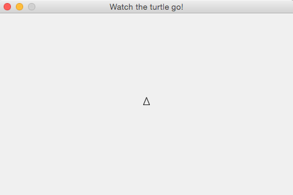
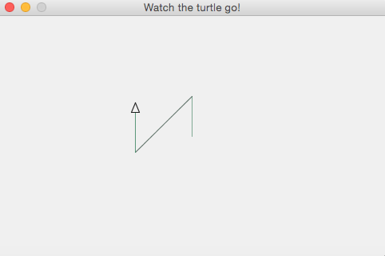
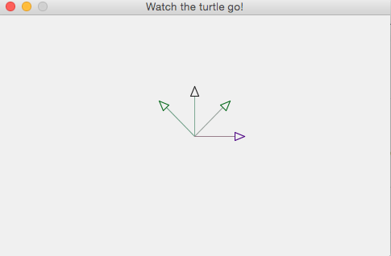
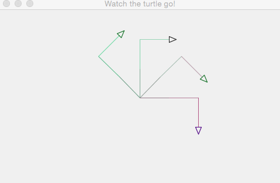

# Turtles application commands

## Basics

- At the beginning, only one turtle whose name is :trinity (don't omit ':'
(colon), it is a Clojure keyword) will show up at the home position (center).
This turtle, :trinity, can move forward/backward,
change head angle clockwise/counterclockwise, or jump.

- Turtles can be added with/without a name.
If no name is given, a new turtle's name will be :smith0, :smith1,
etc.

- Each turtle can move independently giving a command with the name.
If no name is given, :trinity is the turtle to receive a command.


## Movement

| command | description |
| ------- | ----------- |
|`(forward len) (forward n len)`| moves the turtle forward by len.|
|`(backward len) (backward n len)`| moves the turtle backward by len.|
|`(right a) (right n a)`| changes the turtle head by a degrees clockwise.|
|`(left a) (left n a)`| changes the turtle head by a degrees counterclockwise.|
|`(undo) (undo n)`| undos the last line and back the turtle.|
|`(home) (home n)`| moves the turtle back to the home position.|
|`(home-all)`| moves all turtles back to the home position.|

### usage examples

```clojure
(forward 30)             ;; :trinity moves
(forward :smith0 40)     ;; :smith0 moves

(backward 35)            ;; :trinity moves
(backward :smith0 100)   ;; :smith0 moves

(right 45)               ;; :trinity tilts her head 45 degrees clockwise
(right :smith0 90)       ;; :smith0 tilts his head 90 degrees clockwise

(left 30)                ;; :trinity tilts her head 30 degrees counterclockwise
(left :smith0 135)       ;; :smith0 tilts his head 135 degrees counterclockwise

(undo)                   ;; :trinity's last line will be removed
(undo :smith0)           ;; :smith0's last line will be removed

(home)                   ;; moves :trinity back to the home position, center
(home :smith0)           ;; moves :smith0 back to the home position, center

(home-all)               ;; moves all turtles back to the home position
```

## Pen

| command | description |
| ------- | ----------- |
|`(pen-up) (pen-up n)`| changes the pen state false. combination with `forward` gives a jumping effect.|
|`(pen-down) (pen-down n)`| changes the pen state true and draws a line afterwards.|


### usage examples

```clojure
(pen-up)                 ;; :trinity's pen will go up
(pen-up :smith0)         ;; :smith0's pen will go up

(pen-down)               ;; :trinity's pen will go down
(pen-down :smith0)       ;; :smith0's pen will go down
```

## Turtle

| command | description |
| ------- | ----------- |
|`(add-turtle) (add-turtle n)`| adds a turtle. if no name given, the turtle will be named, :smith0, :smith1, ...|
|`(turtle-names)`| returns all turtle names.|
|`(state?) (state? n)`| returns a current state of the turtle.|


### usage examples

```clojure
(add-turtle)             ;; adds a turtle whose name is :smith0, then :smith1, ...
(add-turtle :neo)        ;; adds a turtle whose name is :neo

(turtle-names)           ;; returns all turtle names

(state?)                 ;; returns :trinity's current state
(state? :smith0)         ;; returns :smith0's current state
```


## Clean up

| command | description |
| ------- | ----------- |
|`(clean) (clean n)`| cleans all lines belong to the turtle. |
|`(clean-all)`| cleans all lines of all turtles. |

### usage examples

```clojure
(clean)                  ;; cleans all of :trinity's lines
(clean :smith0)          ;; cleans all of :smith0's lines

(clean-all)              ;; cleans all turtles all lines
```


## Samples

#### 1. start up

```clojure
user=> (use 'clojure-turtle.core)
WARNING: repeat already refers to: #'clojure.core/repeat in namespace: \
user, being replaced by: #'clojure-turtle.core/repeat
nil
user=> (turtle-names)
(:trinity)
user=> (state?)
[:trinity {:x 0, :y 0, :angle 90, :pen true, :color [30 30 30]}]
```




#### 2. move turtle

```clojure
user=> (forward 50)
[:trinity 50]
user=> (right 45)
[:trinity 45]
user=> (backward 100)
[:trinity -100]
user=> (left 45)
[:trinity -45]
user=> (forward 50)
[:trinity 50]
user=> (state?)
[:trinity {:x -70.71068094436272, :y 29.289320335914155, :angle 90, :pen true, :color [30 30 30]}]
```




#### 3. add turtles

```clojure
user=> (add-turtle)
[:smith0 {:x 0, :y 0, :angle 90, :pen true, :color [10 107 30]}]
user=> (add-turtle)
[:smith1 {:x 0, :y 0, :angle 90, :pen true, :color [10 107 30]}]
user=> (add-turtle :neo)
[:neo {:x 0, :y 0, :angle 90, :pen true, :color [75 0 130]}]
user=> (turtle-names)
(:trinity :smith0 :smith1 :neo)
user=> (left :smith0 45)
[:smith0 -45]
user=> (right :smith1 45)
[:smith1 45]
user=> (right :neo 90)
[:neo 90]
user=> (forward 50)
[:trinity 50]
user=> (forward :smith0 50)
[:smith0 50]
user=> (forward :smith1 50)
[:smith1 50]
user=> (forward :neo 50)
[:neo 50]
```




#### 4. put the same commands to four turtles together

```clojure
(doseq [n (turtle-names)] (forward n 50))
(doseq [n (turtle-names)] (right 90))
(doseq [n (turtle-names)] (forward n 50))
```




#### 5. put three `doseq` in one

```clojure
(doseq [n (turtle-names)]
  (forward n 50)
  (right 90)
  (forward n 50))
```

#### 6. start over by a function

Assuming there are already four turtles added:

```clojure
(defn four-turtles
  []
  (clean-all)
  (home-all)
  (left :smith0 45)
  (right :smith1 45)
  (right :neo 90)
  (doseq [n (turtle-names)]
    (forward n 50)))

(four-turtles)
```


License
-------
<a rel="license"
href="http://creativecommons.org/licenses/by/4.0/deed.en_US"></a><br
/><span xmlns:dct="http://purl.org/dc/terms/"
href="http://purl.org/dc/dcmitype/Text" property="dct:title"
rel="dct:type">ClojureBridge Curriculum</span> by <span
xmlns:cc="http://creativecommons.org/ns#"
property="cc:attributionName">ClojureBridge</span> is licensed under a
<a rel="license"
href="http://creativecommons.org/licenses/by/4.0/deed.en_US">Creative
Commons Attribution 4.0 International License</a>.
