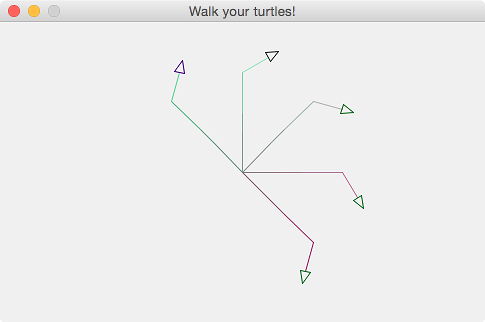
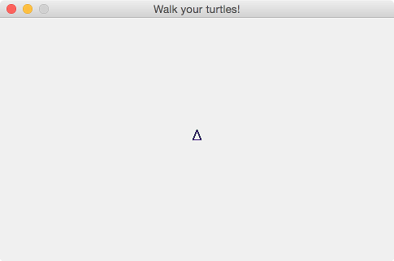
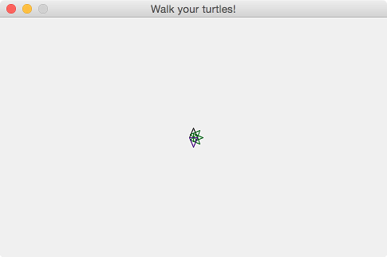
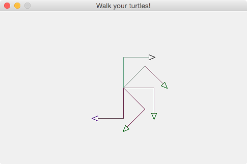
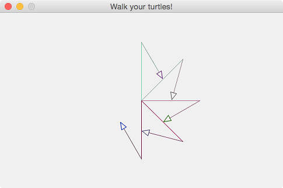
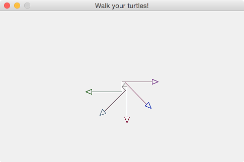
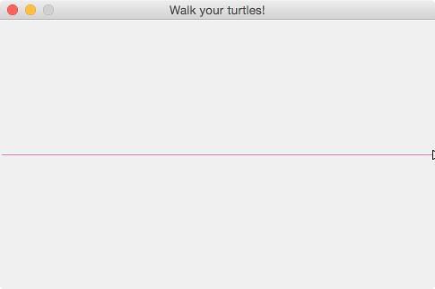
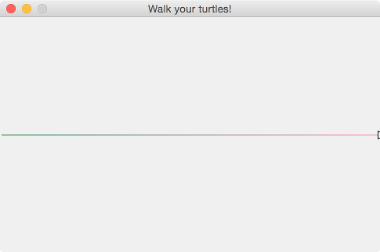

# How to Walk Turtles

Here are some instructions from very basic to a little bit high level
ones to walk turtles.

Walk them and draw lines by your imagination!

#### 1. Start up

We assume that you have successfully installed all the needed software during [Installfest](https://github.com/clojurebridge-boston/installfest)  and know how to start the programs we are using. Feel free to take a look there to check what there programs are and how to access them. Mentors are also here in case you have a question or something isn't working. 

If you haven't cloned the project repository yesterday at the Installfest, follow the instructions there to install and open a `git` terminal and type (pressing enter after each command): 
```bash
git clone https://github.com/clojurebridge-boston/track1-turtles.git
cd track1-turtles
```
##### 1.1 Opening and running the project:

- Start Nightcode and open the project in Nightcode by clicking "Import" in the menu and choosing the folder where the project was downloaded (`track1-turtles`). 
- Open the project folder and its subfolder `src` in the left upper tab. 
- Click on the file `walk.clj` so that it is highlighted.
- In the right lower corner panel click on the button "Run with REPL". 
- Once the command finishes (it will print several lines ending with `=> user`; this may take a bit of time), click on Reload button.
<!--
- Once that finishes, click on Eval. You should see a window pop up with a little triangle in it, facing up, as shown below: 
-->

You will see the following in the right bottom panel:
```clojure
user=> 
["walk.clj"]
clojurebridge-turtle.walk=> 
```
This is a place where you can type turtle commands. You will also see your first turtle in a little pop-up window! 

<!--
_EM commentt: Nightcode instructions instead:_

open the file
`track1-turtles/src/clojurebridge_turtle/walk.clj`.
Then,
<kbd>Ctrl</kbd> + <kbd>Shift</kbd> + <kbd>Enter</kbd> or
<kbd>Cmd</kbd> + <kbd>Shift</kbd> + <kbd>Enter</kbd> to evaluate the
file.

Once the turtles app starts running, evaluate each form (code fragment
enclosed by matching parentheses) by hitting,
<kbd>Ctrl</kbd> + <kbd>Enter</kbd> or
<kbd>Cmd</kbd> + <kbd>Enter</kbd> at the end of the line or function definition.


- load walk.clj on lein repl

startup repl, then run `require` and `ns`.

```clojure
user=> (require 'clojurebridge-turtle.walk)
nil
user=> (ns clojurebridge-turtle.walk)  ;; no need to run this on LightTable
nil
clojurebridge-turtle.walk=> (turtle-names)
[:trinity]
clojurebridge-turtle.walk=> (state)
{:trinity {:x 0, :y 0, :angle 90, :color [106 40 126]}}
```
-->


_EM: discuss interactions with Nightcode, errors, troubleshooting_

_EM: up arrow gives you your previous command that you can then edit. If you make a mistake, just retype your command (or use the up arrow to bring it back, and then correct)._


See [TURTLE.md](TURTLE.md) for commands that turtles understand.


- `undo`, `clean`, and `home`

When the turtle has gone unexpectedly long or short distance, we can delete the
line one by one using `undo`.
If the turtle should start from its initial state,
a combination of `clean` and `home` commands takes the turtle back to
the initial state.

- `state`

When the turtle goes far away beyond the boundary, or you lost which
one is what, you can check where they are by this command. The command
returns absolute values from the position (0,0) in the middle of the canvas. Note that coordinates are computed with some rounding error, they are not whole numbers. 

For instance, when the following shows the state changes when `:trinity` starts at (0,0), moves forward by 20, then turns right 45 degrees, and moves forward by 20 again. 
```clojure
clojurebridge-turtle.walk=> (init)
:trinity
clojurebridge-turtle.walk=> (state)
{:trinity {:x 0, :y 0, :angle 90, :color [106 40 126]}}
clojurebridge-turtle.walk=> (forward 20)
{:trinity {:length 20}}
clojurebridge-turtle.walk=> (state)
{:trinity {:x -8.742278000372482E-7, :y 19.99999999999998, :angle 90, :color [106 40 126]}}
clojurebridge-turtle.walk=> (right 45)
{:trinity {:angle 45}}
clojurebridge-turtle.walk=> (forward 20)
{:trinity {:length 20}}
clojurebridge-turtle.walk=> (state)
{:trinity {:x 14.142134440416944, :y 34.142135932817126, :angle 45, :color [106 40 126]}}
```

[note] The `forward`/`backward` or `right`/`left` commands take a
relative value to the current state.

- `doc`

Without looking at command reference, we can check how to use each
function by Clojure's `doc`. For example, `(doc forward)` displays
its usage:
```clojure
-------------------------
clojurebridge-turtle.core/init
([])
  returns to the starting state.
   only :trinity is in the home position.
nil
```


#### 2. [easy] Basic movement - forward, backward, right and left

- forward

```clojure
clojurebridge-turtle.walk=> (forward 40)
{:trinity {:length 40}}
```


- right

```clojure
clojurebridge-turtle.walk=> (right 90)
{:trinity {:angle 90}}
```


Try typing in the following movements, or some of your own, to move `:trinity` around. 

- combinations of forward and right:

```clojure
clojurebridge-turtle.walk=> (forward 40)
{:trinity {:length 40}}
clojurebridge-turtle.walk=> (right 90)
{:trinity {:angle 90}}
clojurebridge-turtle.walk=> (forward 50)
{:trinity {:length 50}}
clojurebridge-turtle.walk=> (right 90)
{:trinity {:angle 90}}
clojurebridge-turtle.walk=> (forward 60)
{:trinity {:length 60}}
clojurebridge-turtle.walk=> (right 90)
{:trinity {:angle 90}}
clojurebridge-turtle.walk=> (forward 70)
{:trinity {:length 70}}
clojurebridge-turtle.walk=> (right 90)
{:trinity {:angle 90}}
clojurebridge-turtle.walk=> (forward 80)
{:trinity {:length 80}}
```


- combination of various commands:

```clojure
clojurebridge-turtle.walk=> (init)
:trinity
clojurebridge-turtle.walk=> (forward 50)
{:trinity {:length 50}}
clojurebridge-turtle.walk=> (right 45)
{:trinity {:angle 45}}
clojurebridge-turtle.walk=> (backward 100)
{:trinity {:length -100}}
clojurebridge-turtle.walk=> (left 45)
{:trinity {:angle -45}}
clojurebridge-turtle.walk=> (forward 50)
{:trinity {:length 50}}
clojurebridge-turtle.walk=> (state)
{:trinity {:x -70.71068094436272, :y 29.289320335914155, :angle 90, :color [106 40 126]}}
```


#### 3. [easy] Multiple turtles

You can add multiple turtles. They all start in the middle, facing up, and are 
all of different colors. You can refer to each turtle by its name.

- add turtles

```clojure
clojurebridge-turtle.walk=> (init)
:trinity
clojurebridge-turtle.walk=> (add-turtle :neo)
{:neo {:x 0, :y 0, :angle 90, :color [12 84 0]}}
clojurebridge-turtle.walk=> (add-turtle :oracle)
{:oracle {:x 0, :y 0, :angle 90, :color [189 63 0]}}
clojurebridge-turtle.walk=> (add-turtle :cypher)
{:cypher {:x 0, :y 0, :angle 90, :color [75 102 125]}}
clojurebridge-turtle.walk=> (turtle-names)
[:trinity :neo :oracle :cypher]
```


Note that once you have more turtles than just `:trinity`, you need to specify what turtle your commands refer to. For instance, if you just type `(forward 30)`, you will get an error "Specify name. You have more than one turtle." 

- make turtles tilt different angles

Note that `*` denotes mutiplication in Clojure, so `(* 2 45)` returns twice 45, which is 90. If we want each turtle to be facing at 45 degrees from the previous one, we can have Clojure do the multiplication for us. 

The parentheses around this expression mean that we are applying `*` to 2 and 45. Here `*` is a function, 2 and 45 are its parameters (also called "arguments"), and we say that we are calling multiplication function on 2 and 45. 

```clojure
clojurebridge-turtle.walk=> (right :neo 45)
{:neo {:angle 45}}
clojurebridge-turtle.walk=> (right :oracle (* 2 45))
{:oracle {:angle 90}}
clojurebridge-turtle.walk=> (right :cypher (* 3 45))
{:cypher {:angle 135}}
```


Feel free to change the multiplication function or its parameters to something else, see what happens. 

- walk four turtles forward

```clojure
clojurebridge-turtle.walk=> (forward :trinity 40)
{:trinity {:length 40}}
clojurebridge-turtle.walk=> (forward :neo 40)
{:neo {:length 40}}
clojurebridge-turtle.walk=> (forward :oracle 40)
{:oracle {:length 40}}
clojurebridge-turtle.walk=> (forward :cypher 40)
{:cypher {:length 40}}
```


#### 4. [easy] Add one more turtle and give them commands

_EM Ah, ok, we can set color. Need to add to the API and make a ref to RGB values (in the API and here)_

- add another turtle named :morpheus with color

```clojure
clojurebridge-turtle.walk=> (add-turtle :morpheus [21, 137, 255])
{:morpheus {:x 0, :y 0, :angle 90, :color [21 137 255]}}
```


- tilt and go forward :morpheus

```clojure
clojurebridge-turtle.walk=> (left :morpheus 45)
{:morpheus {:angle -45}}
clojurebridge-turtle.walk=> (forward :morpheus 40)
{:morpheus {:length 40}}
clojurebridge-turtle.walk=> (turtle-names)
[:trinity :neo :oracle :cypher :morpheus]
```


_EM comment: shorten, perhaps_

- walk five turtles forward by 20

```clojure
clojurebridge-turtle.walk=> (forward :trinity 20)
{:trinity {:length 20}}
clojurebridge-turtle.walk=> (forward :neo 20)
{:neo {:length 20}}
clojurebridge-turtle.walk=> (forward :oracle 20)
{:oracle {:length 20}}
clojurebridge-turtle.walk=> (forward :cypher 20)
{:cypher {:length 20}}
clojurebridge-turtle.walk=> (forward :morpheus 20)
{:morpheus {:length 20}}
```


#### 5. [easy - intermediate] Move all five turtles - introduction to function

We've had five turtles and want to move or tilt those five.
Let's think how we can make all five turtles go forward by 40?
The simplest way would be to type `(forward :name 40)` five times.

But wait. We are almost exhausted to type quite similar commands many times.
Is there any handy way of doing this? Yes, there is.
Clojure has uses functions to accomplish this purpose.

<!--

_EM: commented out doseq_

`doseq` function is one of them.

- 5.1 move 5 turtles forward using `doseq` function

```clojure
clojurebridge-turtle.walk=> (doseq [n (turtle-names)] (forward n 40))
nil
```
-->


- 5.1 using `map` function (a higher order function)

_EM: A LOT MORE EXPLANATION IS NEEDED HERE; SHOULD USE SLIDES AS WELL_

We can find out the names of all turtles by using `(turtle-names)`, this will give us a list `(:trinity :neo :oracle :cypher :morpheus)`. Then we can use a function `map` to go over the list and tell each turtle to move forward. 

If we want `:trinity` to move forward by 40, we say `(forward :trinity 40)`. If we want `:neo` to do the same, we say `(forward :neo 40)`. Note that the command is the same. What changes is the name, and we would like each of the turtles' names be used. 

`map` allows us to provide a "template" for the command in which the name will be filled in for each turtle as the function goes through the list of names. The "template" function is `#(forward % 40)`, where the `%` is the turtle name that will be each of the turtles, one by one. 

```clojure
clojurebridge-turtle.walk=> (map #(forward % 40) (turtle-names))
({:trinity {:length 40}} {:neo {:length 40}} {:oracle {:length 40}} {:cypher {:length 40}} {:morpheus {:length 40}})
```
What do you think will happen if you type the following? 
```clojure
clojurebridge-turtle.walk=> (map #(forward % 40) '(:neo :oracle))
``` 
Don't worry about the single quote in `'(:neo :oracle)`, this is just how you give lists of things to Clojure. 

Can you now make all turtles turn right by 90 degrees using `map`?
Can you make only `:trinity` and `:morpheus` turn some more? Experiment with map until you are comfortable using it. Ask mentors questions if you have them. 

Note: don't try to make turtles do two things at once, in one `map`. We will get to it later.  


<!--
- 5.3 tilt and forward them by `doseq`s

```clojure
clojurebridge-turtle.walk=> (doseq [n (turtle-names)] (right n 60))
nil
clojurebridge-turtle.walk=> (doseq [n (turtle-names)] (forward n 30))
nil
```


-->


<!--
- 5.4 [bonus] put two `doseq`s in one

```clojure
clojurebridge-turtle.walk=> (doseq [n (turtle-names)]
                       #_=> (right n 60)
                       #_=> (forward n 30))
nil
```
-->

- 5.5 [bonus] using `map` (higher order function) and `juxt` functions

_EM: juxt is needed because you can't use comp: forward and friends do not return turtles> Need to explain briefly what juxt is. Show juxt on a single turtle?_

```clojure
clojurebridge-turtle.walk=> (map (juxt #(right % 60) #(forward % 30)) (turtle-names))
([{:trinity {:angle 60}} {:trinity {:length 30}}]
[{:neo {:angle 60}} {:neo {:length 30}}]
[{:oracle {:angle 60}} {:oracle {:length 30}}]
[{:cypher {:angle 60}} {:cypher {:length 30}}]
[{:morpheus {:angle 60}} {:morpheus {:length 30}}])
```
#### 6. [easy - intermediate] Define variables and functions. 

_EM: somewhere here we also explain let_

_EM: also, here we may start writing code in the walk.clj file_

#### 6. [easy - intermediate] Write a function that adds turtles

> Use <kbd>Ctrl</kbd> + <kbd>Enter</kbd> or
> <kbd>Cmd</kbd> + <kbd>Enter</kbd> at the end of each line or last
> line of function definition on LightTable

While playing around with turtles, we may mess up their movements.
The `(init)` command makes everything clean up and back to the initial state.
It is a good command, but again, we need to repeat `(add-turtle name)`
command many times to get five turtles.

We want something. Yes, we can define our own function for that.
Once the function is defined, we can add five turtles by a single
function call anytime.


- 6.1 define a function to add three turtles and a turtle with the name :neo

Since we already have :trinity, we are going to add four turtles.
Let's name them, :neo, :oracle, :cypher, :morpheus.
Once all are added, we will get five turtles in total.

```clojure
;; function definition
(defn add-four-turtles
  []
  (let [names [:neo :oracle :cypher :morpheus]]
    (init)
    (dotimes [i (count names)] (add-turtle (nth names i)))))

;; usage of the five-turtles function
(add-four-turtles)

;; check turtle names
(turtle-names)
```



#### ?? Exercise: chaotic turtles

_EM: make a bunch of turtles and move them in random directions_

#### ?? Bouncing off the walls

_EM once a turtle is close to hitting a wall, it turns around_

- 6.2 [bonus] add a parameter to `add-four-turtles` function so that
each turtle can take specified name.

_EM: not sure multi-arity functions are worth the time at this point_

Our `add-four-turtles` function uses hard-coded names for turtles.
Instead, let's enjoy a freedom to choose any name for them without
rewriting the function.

Now, we are going to write **multi-arity function**. The arity means a
number of arguments the function takes. For example, our
`add-four-turtle` function so far takes zero argument only. If we add
`add-four-turtle` function which takes one argument, the function
turns to a multi-arity function. This is because the function takes
zero or one argument.


```clojure
;; function definition
(defn add-four-turtles
  ([] (add-four-turtles [:neo :oracle :cypher :morpheus]))
  ([names]
    (init)
    (dotimes [i (count names)] (add-turtle (nth names i)))))

;; usage example
(add-four-turtles)                                 ;; uses predefined names
(add-four-turtles [:taylor :tess :tiffany :tracy]) ;; uses given names

;; check turtle names
(turtle-names)
```

Look at the multi-arity function above once more. The
`add-four-turtles` function doesn't need to have `four` in its name.
The number of turtles can be any. If you list two names in the vector,
the function will add two turtles.

_EM: I am not sure where they are going with this_

- 6.3 [bonus] [exercise] make `add-four-turtles` to add exactly four turtles

We can add a check so that only when four names are provided, the
function adds four turtles; otherwise does nothing.

Hint: function body will look like:

```clojure
(if (= 4 (count names))
  ....blah blah blah...)
```

- 6.4 side note

Suppose you have already five turtles and continue using the same
turtles. But, you want to clean up all lines and make them home
position. In such a case, a combination of `clean-all` and
`home-all` gives the same effect as `add-four-turtles` function.

```clojure
;; deletes all lines
(clean-all)

;; moves all turtles back to the home position
(home-all)

;; check turtles' names
(turtle-names)
```

#### ?. [intermediate] Exercise on filter

#### 7. [intermediate] Write a function that tilts five turtles in different directions

Next, we want to tilt five turtles' heads in different angles so that
we can see their move well. For example, :trinity 0, :neo 45, :oracle
90, :cypher 135, :morpheus 180.
This function will be no more straightforward like we wrote so far.
Since we need two kinds of parameters at the same time, name and
angle, while previous functions used only one kind of parameter.

Again, Clojure has many ways to do this.

_EM: I am not a fan of doseq, would remove it in favor of map_

- 7.1 using `doseq` with a little tweak

Let's think how we can use `doseq` here also.

- 7.1.1 put two parameters in one hash map

If we put two-parameter pair together to form one, we can use `doseq` like previous examples.

```clojure
;; put turtle names and digits together and create a hash map
clojurebridge-turtle.walk=> (def m (zipmap (turtle-names) (range 0 (count (turtle-names)))))
#'clojurebridge-turtle.walk/m
clojurebridge-turtle.walk=> m
{:trinity 0, :neo 1, :oracle 2, :cypher 3, :morpheus 4}

;; see each part is doing what
clojurebridge-turtle.walk=> (count (turtle-names))
5
clojurebridge-turtle.walk=> (range 0 5)
(0 1 2 3 4)
clojurebridge-turtle.walk=> (zipmap [:a :b] [0 1])
{:a 0, :b 1}
```

- 7.1.2 use `doseq` to iterate hash map

```clojure
;; using m which is created by zipmap
(doseq [t m] (right (first t) (* (second t) 45)))

;; again, see each part is doing what

;; see how doseq uses m
clojurebridge-turtle.walk=> (doseq [t m] (prn t))
[:trinity 0]
[:neo 1]
[:oracle 2]
[:cypher 3]
[:morpheus 4]
nil

;; see first and second function do
clojurebridge-turtle.walk=> (doseq [t m] (prn (first t) (second t)))
:trinity 0
:neo 1
:oracle 2
:cypher 3
:morpheus 4
nil

;; see what (* (second t) 45) does
clojurebridge-turtle.walk=> (doseq [t m] (prn (first t) (* (second t) 45)))
:trinity 0
:neo 45
:oracle 90
:cypher 135
:morpheus 180
nil
```

- 7.1.3 put hash map creation and `doseq` in one function

```clojure
;; function definition
(defn tilt-turtles
  []
  (let [m (zipmap (turtle-names) (range 0 (count (turtle-names))))]
    (doseq [t m] (right (first t) (* (second t) 45)))))

;; usage
(tilt-turtles)
```




- 7.2 [bonus] map function (higher order function) is another way to do

Using `map` function, tilt-turtles function can be written a single
line as in below.

```clojure
clojurebridge-turtle.walk=> (map #(right % (* %2 45)) (turtle-names) (range 0 (count (turtle-names))))
({:trinity {:angle 0}} {:neo {:angle 45}} {:oracle {:angle 90}}
{:cypher {:angle 135}} {:morpheus {:angle 180}})
```

- 7.3 [bonus] recursion is another way to do

```clojure
;; function definition
(defn tilt-turtles-loop
  []
  (loop [t nil
         n (turtle-names)
         s 0]
    (if (empty? n) :completed
        (recur (right (first n) (* s 45)) (rest n) (inc s)))))

;; usage
(tilt-turtles-loop)
```

#### 8. [intermediate] Write a function that moves five turtles forward, right and forward again

We got five turtles, made their heads tilted in different directions.
It's time to move all those five turtles, forward, right and forward.

- 8.1 put three movements in one `doseq`

Like we tried in 5.4, only one `doseq` works for the three movements.

```clojure
(doseq [n (turtle-names)]
  (forward n 60)
  (right n 90)
  (forward n 50))
```




- 8.2 change parameters of forwards and right

Putting three movements in one `doseq` is nice, but what if we want to
change parameters?
For example, forward 100, right 150, then forward 60, or
forward 50, right 30, and forward 60.

Defining a function that takes parameters is the way to do.

```clojure
;; function definition
(defn doseq-with-params
  [len1 len2 angle]
  (doseq [n (turtle-names)]
    (forward n len1)
    (right n angle)
    (forward n len2)))

;; usage example
(home-all)
(clean-all)
(tilt-turtles)

(doseq-with-params 100 60 150)
```




Try various parameters.


#### 9. [intermediate] put whole stuff in a function

So far, we added four turtles and got five in total.
Each turtle's head was tilted in a different direction.
Finally, five turtles walked forward, changed heads by some degrees,
then walked again.
There were three steps.

We've already learned writing a function makes things put into one, and
repeating the same sequence makes very easy.

- 9.1 write a function so that all three steps can be done by only one function.

```clojure
;; definition of walk-five-turtles functions
(defn walk-five-turtles
  [names len1 len2 angle]
  (add-four-turtles names)
  (tilt-turtles)
  (doseq-with-params len1 len2 angle))

;; usage examples
(walk-five-turtles [:taylor :tess :tiffany :tracy] 10 60 90)
```




- 9.2 [bonus] use hash map as a function parameter

As a number of function parameters increases, it goes confusing.
For example, if we misunderstand the order of len2 and angle, turtles
may go beyond the boundary.

To solve this problem, hash map is often used as a function parameter.
The parameters in the hash map are picked up using destructuring.
It is handy.


```clojure
;; function definition
(defn walk-five-turtles-map
  [{:keys [names len1 len2 angle]}]
  (add-four-turtles names)
  (tilt-turtles)
  (doseq-with-params len1 len2 angle))


;; usage example
(walk-five-turtles-map {:names [:taylor :tess :tiffany :tracy] :len1 10 :len2 60 :angle 90})
```

If we look at the usage example, it's clear what parameter goes where.


#### #. side note: forward 480 and 48 times of forward 10

Going forward 480 and repeating 48 times of forward 10 are not the
same for the turtles.
To see the difference, let define an utility function, `leftmost` first.
This function moves a turtle to the leftmost position.

```clojure
;; function definition

(defn leftmost
  [n]
  (home n)
  (clean n)
  (left n 90)
  (forward n 240)
  (clean n)
  (right n 180))
```

Once the turtle moves to the leftmost position, try two types of forwards.

```clojure
clojurebridge-turtle.walk=> (leftmost :trinity)
{:trinity {:angle 180}}

;; forward 480
clojurebridge-turtle.walk=> (forward :trinity 480)
{:trinity {:length 480}}
```



```clojure
clojurebridge-turtle.walk=> (leftmost :trinity)
{:trinity {:angle 180}}

;; 48 times of forward 10
clojurebridge-turtle.walk=> (dotimes [i 48] (forward :trinity 10))
nil
```



Both walked the turtle from the leftmost to rightmost position,
however, the colors are not the same.
The stroke's color is calculated from the x, y values of the endpoint.
Forwarding 480 has only one endpoint, while forwarding 48 times has 48
endpoints.
This means the turtle changed the color 48 times.


License
-------
<a rel="license"
href="http://creativecommons.org/licenses/by/4.0/deed.en_US"></a><br
/><span xmlns:dct="http://purl.org/dc/terms/"
href="http://purl.org/dc/dcmitype/Text" property="dct:title"
rel="dct:type">ClojureBridge Curriculum</span> by <span
xmlns:cc="http://creativecommons.org/ns#"
property="cc:attributionName">ClojureBridge</span> is licensed under a
<a rel="license"
href="http://creativecommons.org/licenses/by/4.0/deed.en_US">Creative
Commons Attribution 4.0 International License</a>.
