#  :turtle:  :turtle: :turtle:  How to Walk Turtles :turtle:  :turtle:  :turtle:

Here are some instructions from very basic to a little bit high level
ones to walk turtles.

Walk them and draw lines by your imagination!

#### 1. Start up

We assume that you have successfully installed all the needed software during [Installfest](https://github.com/clojurebridge-boston/installfest)  and know how to start the programs we are using. Feel free to take a look there to check what these programs are and how to access them. Mentors are also here in case you have a question or something isn't working. 

If you haven't cloned the project repository yesterday at the [Installfest](https://github.com/clojurebridge-boston/installfest), follow the instructions there to install and open a `git` terminal and type (pressing enter after each command): 
```bash
git clone https://github.com/clojurebridge-boston/track1-turtles.git
cd track1-turtles
```
##### 1.1 Opening and running the project:

- Start Nightcode and open the project in Nightcode by clicking "Import" in the menu and choosing the folder where the project was downloaded (`track1-turtles`). 
- Open the project folder and its subfolder `src` in the left upper panel of Nightcode. 
- Click on the file `walk.clj` so that it is highlighted.
- In the right lower corner panel click on the button "Run with REPL". 
- Once the command finishes (it will print several lines ending with `=> user`; this may take a bit of time), click on Reload button.

You will see the following in the right bottom panel:
```clojure
user=> 
["walk.clj"]
clojurebridge-turtle.walk=> 
```
This is a place where you can type turtle commands. You will also see your first turtle in a little pop-up window! 

We will refer to the little pop-up window as the canvas since that's where turtle drawings go.

<!--
_EM commentt: Nightcode instructions instead:_

open the file
`track1-turtles/src/clojurebridge_turtle/walk.clj`.
Then,
<kbd>Ctrl</kbd> + <kbd>Shift</kbd> + <kbd>Enter</kbd> or
<kbd>Cmd</kbd> + <kbd>Shift</kbd> + <kbd>Enter</kbd> to evaluate the
file.

Once the turtles app starts running, evaluate each form (code fragment
enclosed by matching parentheses) by hitting,
<kbd>Ctrl</kbd> + <kbd>Enter</kbd> or
<kbd>Cmd</kbd> + <kbd>Enter</kbd> at the end of the line or function definition.


- load walk.clj on lein repl

startup repl, then run `require` and `ns`.

```clojure
user=> (require 'clojurebridge-turtle.walk)
nil
user=> (ns clojurebridge-turtle.walk)  ;; no need to run this on LightTable
nil
clojurebridge-turtle.walk=> (turtle-names)
[:trinity]
clojurebridge-turtle.walk=> (state)
{:trinity {:x 0, :y 0, :angle 90, :color [106 40 126]}}
```
-->

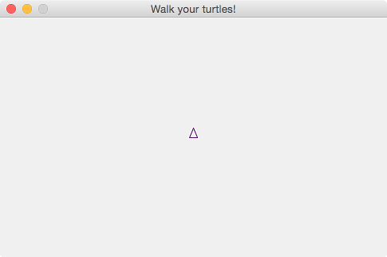

For the first few tasks you will be typing your commands into the right bottom area known as the REPL. REPL stands for *Read-Evaluate-Print Loop*, and it's a place to interact with Clojure: you type in what you want it to do, it performs the operation and gives you back the result. 

Place your cursor at the end of the line: 
```clojure
clojurebridge-turtle.walk=> 
```

Type `(forward 30)` and press enter:
```clojure
clojurebridge-turtle.walk=> (forward 30)
{:trinity {:length 30}}
clojurebridge-turtle.walk=> 
```

This command moves the turtle on the canvas forward by 30 pixels in the direction it is facing:

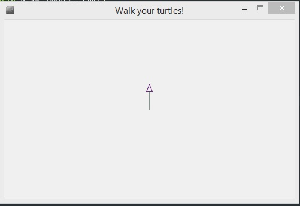


At some point in your interactions you may have many turtles on the canvas, so turtles are created with names to tell them apart. The very first turtle on the canvas is called `:trinity`. Note the colon `:` in front of the name; all turtle names will start with a colon. 

After you have entered a command, the turtle moves, and REPL displays what move it just made. In this case it said `{:trinity {:length 30}}` indicating the `:trinity` moved forward by 30 pixels. 

See [TURTLE.md](TURTLE.md) for commands that turtles understand. Experiment with moving `:trinity` around. 

##### 1.2 Helpful tips on interacting with Clojure

 - You can use up arrow in REPL to bring up the previous command. You can repeat it as is, or change it, and press enter.   


###### `(undo)`, `(clean)`, and `(home)`
---
When the turtle has gone unexpectedly long or short distance, we can delete the
line one by one using `(undo)`.
If the turtle should start from its initial state,
a combination of `(clean)` and `(home)` commands takes the turtle back to
the initial state.   

###### `(state)` 
---
When the turtle goes far away beyond the boundary, or you lost which turtle
is which, you can check where a turtle is using this `(state)`. `(state)`
returns absolute values from the position (0,0) in the middle of the canvas. Note that coordinates are computed with some rounding error, they are not whole numbers.   

For instance, when the following shows the state changes when `:trinity` starts at (0,0), moves forward by 20, then turns right 45 degrees, and moves forward by 20 again. 
```clojure
clojurebridge-turtle.walk=> (init)
:trinity
clojurebridge-turtle.walk=> (state)
{:trinity {:x 0, :y 0, :angle 90, :color [106 40 126]}}
clojurebridge-turtle.walk=> (forward 20)
{:trinity {:length 20}}
clojurebridge-turtle.walk=> (state)
{:trinity {:x -8.742278000372482E-7, :y 19.99999999999998, :angle 90, :color [106 40 126]}}
clojurebridge-turtle.walk=> (right 45)
{:trinity {:angle 45}}
clojurebridge-turtle.walk=> (forward 20)
{:trinity {:length 20}}
clojurebridge-turtle.walk=> (state)
{:trinity {:x 14.142134440416944, :y 34.142135932817126, :angle 45, :color [106 40 126]}}
```

[note] The `forward`/`backward` or `right`/`left` commands take a
relative value to the current state.

###### `doc`

---
Without looking at command reference, we can check how to use each
function by Clojure's `doc`. For example, `(doc init)` displays
its usage:
```clojure
-------------------------
clojurebridge-turtle.core/init
([])
  returns to the starting state.
  only :trinity is in the home position.
nil
```

##### 1.3 How to deal with errors

If you made a mistake, you will get an error message from Clojure. 

For instance, if you mistype a command name, you would see something like this:
```clojure
clojurebridge-turtle.walk=> (frward 70)
CompilerException java.lang.RuntimeException: Unable to resolve symbol: frward in this context, compiling:(C:\Users\E\AppData\Local\Temp\form-init8602391256138879508.clj:1:1) 
clojurebridge-turtle.walk=> 
```
This means that Clojure doesn't know what `frward` is. 

Error messages may be very confusing at first. Don't forget to look at [TURTLE.md](TURTLE.md) to see how the commands should be used: a very small difference, such as using an upper case letter instead of a lower case, will make Clojure not understand a name or a function. You will want to keep [TURTLE.md](TURTLE.md) file open in a browser tab so that you can look at it as needed.

If something goes wrong, read what you just typed and the error message. Some things to know: _arity_ refers to how many arguments (i.e. inputs) a function is supposed to take. Sometimes Clojure will say that it cannot convert, or cast, one type of thing to another. That probably means that you are putting in a wrong type of an argument into a function (for instance, a name instead of a number). 

Most errors will just spit out an error message at you and let you try typing in another command. But some errors can confuse Clojure beyond the point of no return. When this happens, Clojure won't give you back the prompt (this thing: `clojurebridge-turtle.walk=> `). If this happens, you will have to click `Run with REPL` and `Reolod`. Unfortunately, this means that all the movements that you have made with your turtles will be lost :cry: 

If you are getting an error and can't figure out what's wrong, ask one of the mentors. After a while you will learn common mistakes, and will be able to fix things easily. 

#### 2. [easy] Basic movement - forward, backward, right and left

###### forward

---

```clojure
clojurebridge-turtle.walk=> (forward 40)
{:trinity {:length 40}}
```

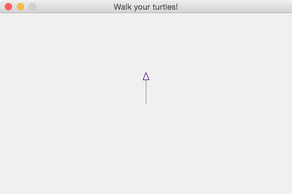


###### right

---

```clojure
clojurebridge-turtle.walk=> (right 90)
{:trinity {:angle 90}}
```

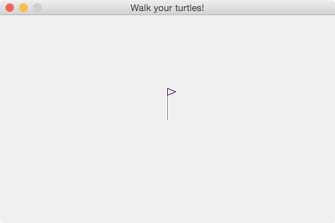

Try typing in the following movements, or some of your own, to move `:trinity` around. 

- combinations of forward and right:

```clojure
clojurebridge-turtle.walk=> (forward 40)
{:trinity {:length 40}}
clojurebridge-turtle.walk=> (right 90)
{:trinity {:angle 90}}
clojurebridge-turtle.walk=> (forward 50)
{:trinity {:length 50}}
clojurebridge-turtle.walk=> (right 90)
{:trinity {:angle 90}}
clojurebridge-turtle.walk=> (forward 60)
{:trinity {:length 60}}
clojurebridge-turtle.walk=> (right 90)
{:trinity {:angle 90}}
clojurebridge-turtle.walk=> (forward 70)
{:trinity {:length 70}}
clojurebridge-turtle.walk=> (right 90)
{:trinity {:angle 90}}
clojurebridge-turtle.walk=> (forward 80)
{:trinity {:length 80}}
```

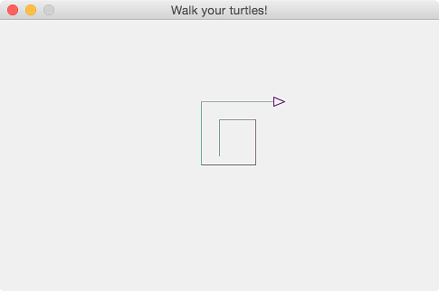


- combination of various commands:

```clojure
clojurebridge-turtle.walk=> (init)
:trinity
clojurebridge-turtle.walk=> (forward 50)
{:trinity {:length 50}}
clojurebridge-turtle.walk=> (right 45)
{:trinity {:angle 45}}
clojurebridge-turtle.walk=> (backward 100)
{:trinity {:length -100}}
clojurebridge-turtle.walk=> (left 45)
{:trinity {:angle -45}}
clojurebridge-turtle.walk=> (forward 50)
{:trinity {:length 50}}
clojurebridge-turtle.walk=> (state)
{:trinity {:x -70.71068094436272, :y 29.289320335914155, :angle 90, :color [106 40 126]}}
```

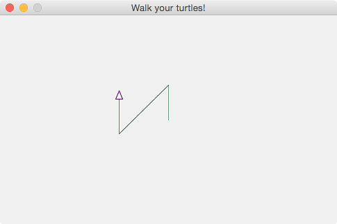

#### 3. [easy] Multiple turtles

You can add multiple turtles. They all start in the middle, facing up, and are 
all of different colors. You can refer to each turtle by its name.

###### add turtles

---

```clojure
clojurebridge-turtle.walk=> (init)
:trinity
clojurebridge-turtle.walk=> (add-turtle :neo)
{:neo {:x 0, :y 0, :angle 90, :color [12 84 0]}}
clojurebridge-turtle.walk=> (add-turtle :oracle)
{:oracle {:x 0, :y 0, :angle 90, :color [189 63 0]}}
clojurebridge-turtle.walk=> (add-turtle :cypher)
{:cypher {:x 0, :y 0, :angle 90, :color [75 102 125]}}
clojurebridge-turtle.walk=> (turtle-names)
[:trinity :neo :oracle :cypher]
```

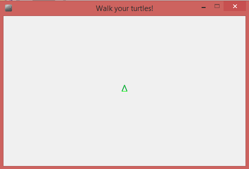

Note that once you have more turtles than just `:trinity`, you need to specify what turtle your commands refer to. For instance, if you just type `(forward 30)`, you will get an error `"Specify name. You have more than one turtle."` 

###### make turtles tilt different angles

---
Note that `*` denotes multiplication in Clojure, so `(* 2 45)` returns twice 45, which is 90. If we want each turtle to be facing at 45 degrees from the previous one, we can have Clojure do the multiplication for us. 

The parentheses around this expression mean that we are applying `*` to 2 and 45. Here `*` is a function, 2 and 45 are its parameters (also called "arguments"), and we say that we are calling multiplication function on 2 and 45. 

```clojure
clojurebridge-turtle.walk=> (right :neo 45)
{:neo {:angle 45}}
clojurebridge-turtle.walk=> (right :oracle (* 2 45))
{:oracle {:angle 90}}
clojurebridge-turtle.walk=> (right :cypher (* 3 45))
{:cypher {:angle 135}}
```

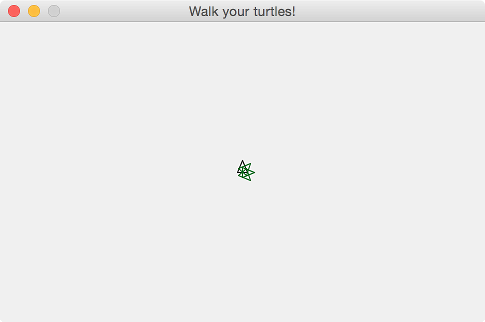

Feel free to change the multiplication function or its parameters to something else, see what happens. 

###### walk four turtles forward

---
```clojure
clojurebridge-turtle.walk=> (forward :trinity 40)
{:trinity {:length 40}}
clojurebridge-turtle.walk=> (forward :neo 40)
{:neo {:length 40}}
clojurebridge-turtle.walk=> (forward :oracle 40)
{:oracle {:length 40}}
clojurebridge-turtle.walk=> (forward :cypher 40)
{:cypher {:length 40}}
```

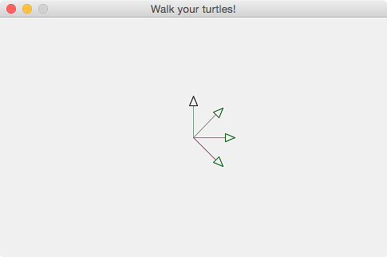


#### 4. [easy] Add one more turtle and give them commands 

###### add another turtle named :morpheus with color

---
You can change the color of the turtle (the triangle) but not the line behind it. 
The way you add color to the turtle might be very different than what you might be used to.
You input colors with three vales (known as RGB values):
- the first changes how much red is in the color
- the second changes how much blue is in the color
- the third changes how much green is in the color   

Each value ranges from 0 to 255. [0, 0, 0] is black, and [255, 255, 255] is white.
Below is an example in code, showing how it works in Clojure.   

[Here](http://www.rapidtables.com/web/color/RGB_Color.htm) is a hepful link where you can play with RGB colors!


```clojure
clojurebridge-turtle.walk=> (add-turtle :morpheus [21, 137, 255])
{:morpheus {:x 0, :y 0, :angle 90, :color [21 137 255]}}
```


###### tilt and move forward :morpheus

---

```clojure
clojurebridge-turtle.walk=> (left :morpheus 45)
{:morpheus {:angle -45}}
clojurebridge-turtle.walk=> (forward :morpheus 40)
{:morpheus {:length 40}}
clojurebridge-turtle.walk=> (turtle-names)
[:trinity :neo :oracle :cypher :morpheus]
```

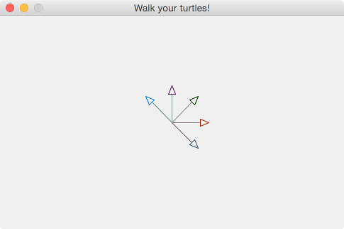

###### walk five turtles forward by 20

---
```clojure
clojurebridge-turtle.walk=> (forward :trinity 20)
{:trinity {:length 20}}
clojurebridge-turtle.walk=> (forward :neo 20)
{:neo {:length 20}}
clojurebridge-turtle.walk=> (forward :oracle 20)
{:oracle {:length 20}}
clojurebridge-turtle.walk=> (forward :cypher 20)
{:cypher {:length 20}}
clojurebridge-turtle.walk=> (forward :morpheus 20)
{:morpheus {:length 20}}
```

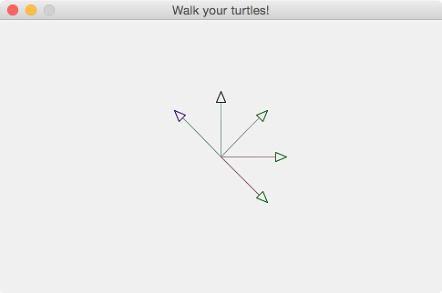


#### 5. [intermediate] Move all five turtles - Clojure functions

We've had five turtles and want to move or tilt those five.
Let's think how we can make all five turtles go forward by 40?
The simplest way would be to type `(forward :name 40)` five times.

But wait. We are almost exhausted to type quite similar commands many times.
Is there any handy way of doing this? Yes, there is.
Clojure has uses functions to accomplish this purpose.

<!--

_EM: commented out doseq_

`doseq` function is one of them.

- 5.1 move 5 turtles forward using `doseq` function

```clojure
clojurebridge-turtle.walk=> (doseq [n (turtle-names)] (forward n 40))
nil
```
-->

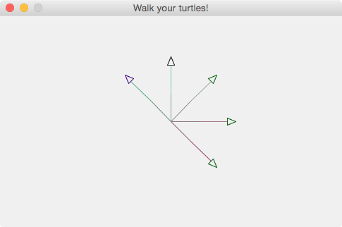


##### 5.1 using `map` function (a higher order function)

We can find out the names of all turtles by using `(turtle-names)`, this will give us a list `(:trinity :neo :oracle :cypher :morpheus)`. Then we can use a function `map` to go over the list and tell each turtle to move forward. 

If we want `:trinity` to move forward by 40, we say `(forward :trinity 40)`. If we want `:neo` to do the same, we say `(forward :neo 40)`. Note that the command is the same. What changes is the name, and we would like each of the turtles' names be used. 

`map` allows us to apply a function to each of the elements in a list and returns a list of all results. For example, we can apply a `forward` function to a list of names of all turtles on the canvas, and they all will move forward. 

We provide a "template" function for the command in which the name will be filled in for each turtle as the function goes through the list of names. The "template" function is `#(forward % 40)`, where the `%` is the turtle name that will be each of the turtles, one by one. 

```clojure
clojurebridge-turtle.walk=> (map #(forward % 40) (turtle-names))
({:trinity {:length 40}} {:neo {:length 40}} {:oracle {:length 40}} {:cypher {:length 40}} {:morpheus {:length 40}})
```
What do you think will happen if you type the following? 
```clojure
clojurebridge-turtle.walk=> (map #(forward % 40) [:neo :oracle])
```  

Can you now make all turtles turn right by 90 degrees using `map`?
Can you make only `:trinity` and `:morpheus` turn some more? Experiment with map until you are comfortable using it. Ask mentors questions if you have them. 

Note: don't try to make turtles do two things at once, in one `map`. We will get to it later.  

##### 5.2 using `map` (higher order function) and `juxt` functions

<!--
_EM: juxt is needed because you can't use comp: forward and friends do not return turtles> Need to explain briefly what juxt is. Show juxt on a single turtle?_
-->

What if you want to have all turtles move forward and then turn? You can do this in one `map` by passing a combination (a juxtaposition) of functions. 

Typing this makes `:neo` first turn right by 60 degrees, and move forward by 30 pixels: 
```clojure
clojurebridge-turtle.walk=> ((juxt #(right % 60) #(forward % 30)) :neo)
[{:neo {:length 50}} {:neo {:angle 30}}]
```  
Try this and other function combinations.    

If we want to make all turtles do a combination of steps, we can use `map` with `juxt`: 
```clojure
clojurebridge-turtle.walk=> (map (juxt #(right % 60) #(forward % 30)) (turtle-names))
([{:trinity {:angle 60}} {:trinity {:length 30}}]
[{:neo {:angle 60}} {:neo {:length 30}}]
[{:oracle {:angle 60}} {:oracle {:length 30}}]
[{:cypher {:angle 60}} {:cypher {:length 30}}]
[{:morpheus {:angle 60}} {:morpheus {:length 30}}])
```
Similarly, we can use map to make a group of turtles, but not all of them, perform a sequence of steps. To do this, you need to replace `(turtle-names)` with a group of some turtle names: `[:neo :morpheus]`. 

A group of things in square brackets is called a _vector_ in Clojure. You can have vectors of names, numbers, or anything else. For instance, turtle color is given as a vector of RGB values (numbers). 

Experiment with `map` and `juxt`. 

#### 6. [intermediate] Define your own functions. 

Clojure has a lot of convenient functions, and we will see quite a few of them. However, if you want to do your own turtle drawings, you would need to write your own functions. It is convenient to give names to functions so that you can use them many times.

##### 6.1 Writing a function to draw a square

Let's say we want my turtle to draw a square. This movement consists of moving forward, turning right, and repeating this on each side of the square. We can write this movement as a function. We don't know which turtle we will be using, and we also want to make it so that we can draw squares of different sizes. Thus we will make the turtle name and the length of the side parameters to the function. 

The function is going to be fairly long, so it's inconvenient to write it in REPL. We will write functions in a file and then load them into REPL. 

- Find the file `yourcode.clj` in the left upper panel of Nightcode and double-click on it. 
- Copy the following code into that file under the things that are already there:
```clojure
(defn draw-square [name length]
  (forward name length)
  (right name 90)
  (forward name length)
  (right name 90)
  (forward name length)
  (right name 90)
  (forward name length)
  (right name 90))
```

Here is what's in it:

-  `defn` is a Clojure keyword for "define a function". You always use it when you want to define a function with a name. 
-  `draw-square` is the name of the function. You can pick whatever name you want. You can use dashes to separate words, but you may not use spaces in function names. 
- `[name length]` are the parameters. In order to tell a turtle to draw a square, we will need to provide a turtle name and the length of the side to the function.
- What follows is the function body, i.e. the commands it's composed of. Note that all our commands use the turtle name, and the `forward` uses the side length.
- Note that we enclose `defn` and the function body in parentheses. Click on the opening parenthesis before `defn` in Nightcode, it will show you the matching closing one (all the way at the end of the function). Nightcode helps you match parentheses (and there is a lot of parentheses in Clojure!)

Now that we have looked at how the function is defined, let's see how it works. 

Reload the file ("Reload" button in Nightcode or Ctrl-Shift-S on Windows, Cmd-Shift-S on a Mac). Nothing changed on the canvas. That's because we haven't actually tell our function to do its work, we only defined what it will do when it works. 

In order to tell it to work we need to _call it_. In Clojure calling a function means that we put its name and parameters (in the right order) in parentheses, such as `(forward :trinity 100)` or `(* 2 45)`. We have been calling functions all along! Now let's call our own function. 

In the REPL panel (lower right) type `(init)` (to make sure that 
the canvas are back to initial state). Then type `(draw-square :trinity 100)`. You will see a nice square drawn by `:trinity`:

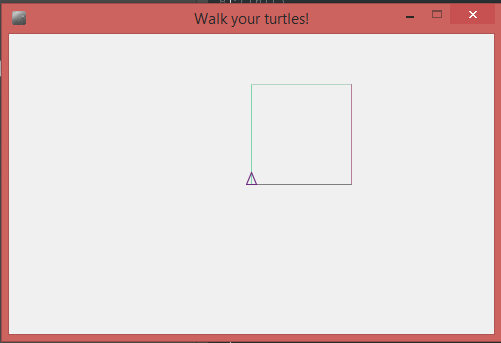

Now type `(draw-square :trinity 50)`. Now there are two squares drawn by `:trinity`. 

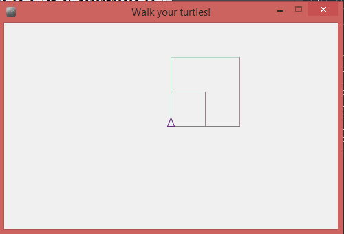

We can also have another turtle draw a couple of squares:

```clojure
clojurebridge-turtle.walk=> (add-turtle :neo)
{:neo {:x 0, :y 0, :angle 90, :color [12 84 0]}}
clojurebridge-turtle.walk=> (right :neo 180)
{:neo {:angle 180}}
clojurebridge-turtle.walk=> (draw-square :neo 100)
{:neo {:angle 90}}
clojurebridge-turtle.walk=> (draw-square :neo 50)
{:neo {:angle 90}}
```

##### 6.2 Using a map with your own function 

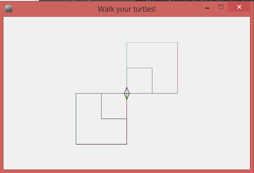

What if we want squares in all four corners? We can have add four turtles one-by-one and have them draw squares, or we can go back to `map` and use it first to add four turtles, and then have them draw the squares. 

Let's start with `(init)` to remove the current squares and make it so that only `:trinity` is on the canvas. 

Recall that `map` takes a function and a vector of things to apply this function to, and applies the function to each element of the vector. If we want to use `map` to add several turtles, our function is `add-turtle` and the list of names can be anything you want. 

The following adds three turtles named `:taylor :tess`, and `:tracy` to the canvas:
```clojure
clojurebridge-turtle.walk=> (map add-turtle [:taylor :tess :tracy])
```
They are all facing up now. At this point we will move them manually so that they are facing different directions (up, down, left, and right). Later we will see that we could do it with a `map` as well. 

```clojure
clojurebridge-turtle.walk=> (right :taylor 90)
{:taylor {:angle 90}}
clojurebridge-turtle.walk=> (right :tess 180)
{:tess {:angle 180}}
clojurebridge-turtle.walk=> (right :tracy 270)
{:tracy {:angle 270}}
```

At this point we can use a `map` to draw squares on all four sides. We have a function `draw-square` that we can map over all turtles. Take a look at the functions, notice that it takes two things: a name and a side length. Thus our map will make a template function that passes the turtle name and the length of a square to our `draw-square`. Let's draw squares of length 100: 

```clojure
clojurebridge-turtle.walk=> (map #(draw-square % 100) (turtle-names))
```
We see that all four turtles made their moves, and here is the resulting picture:

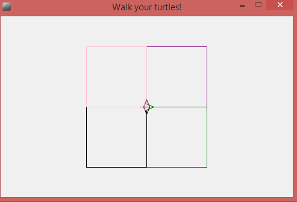

Let's do it again, change the size of the squares in the template (don't forget to use Up arrow in Nightcode REPL to bring back the previous command, this way you just change one number):

```clojure
clojurebridge-turtle.walk=> (map #(draw-square % 50) (turtle-names))
``` 

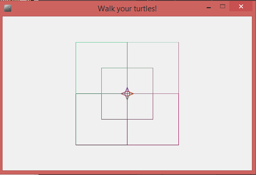

##### 6.3 Using functions in functions; code refactoring

Before we move on to the next Clojure features, let's look back at what we have accomplished. We wrote a function to draw a square that takes a turtle name and the length of the side as parameters, and directs that turtle to move in a square pattern. Then we used this function to map over four turtle to draw four squares. 

Looking at the function, I notice that it is still quite repetitive: it repeats the forward/right combination four times, and it's exactly the same commands! 

We would like to make it look better by creating a _helper function_ `draw-side-of-square` that will draw a side of a square:
```clojure
(defn draw-side-of-square [name length]
  (forward name length)
  (right name 90))
```
Press _Reload_ (or use the shortcut Ctrl-Shift-S on Windows or Ctrl-Cmd-S on a Mac) to reload your file since you have added a function. Use `(init)` to clear the canvas and test your function by typing `(draw-side-of-square :trinity 100)` to have `:trinity` draw a line and turn right (it's important to reload your program code and test your functions every time you have added something to the file).  
 
Now we will use the helper function to rewrite our `draw-square` function: we will use it four times to draw four sides. Here is what `yourcode.clj` file will look like after the change (it's important that the new function is above the `draw-square` since it is used in it):
```clojure
(ns clojurebridge-turtle.walk
  (:use clojure.repl)
  (:use clojurebridge-turtle.core))

;; You might want to start with (init) to make sure
;; that the canvas are in the initial state: 
;; only :trinity is on the canvas, at the center
;(init)

(defn draw-side-of-square [name length]
  (forward name length)
  (right name 90))

(defn draw-square [name length]
  (draw-side-of-square name length)
  (draw-side-of-square name length)
  (draw-side-of-square name length)
  (draw-side-of-square name length))
```

The process of changing existing program code to make it more readbable or more efficient, without changing what it does, is called _refactoring_. 

This is much easier to read, and these functions are very useful, we expect to use them more. Since they are useful, we also want to put s description in them to let those who will be using them know what they do. The comments describing what a function does go after the function name and before its parameters, and are written in double-quotes:

```clojure
(ns clojurebridge-turtle.walk
  (:use clojure.repl)
  (:use clojurebridge-turtle.core))

;; You might want to start with (init) to make sure
;; that the canvas are in the initial state: 
;; only :trinity is on the canvas, at the center
;(init)

(defn draw-line-and-turn 
  "Makes a turtle with the given name draw a line of the given length 
   and then turn right 90 degrees"
  [name length]
  (forward name length)
  (right name 90))

(defn draw-square 
 "Makes a turtle with the given name draw a square of the given length of side" 
  [name length]
  (draw-line-and-turn name length)
  (draw-line-and-turn name length)
  (draw-line-and-turn name length)
  (draw-line-and-turn name length))
```

Now Reload your file and try this in REPL:  
```clojure
(doc draw-square)
```

What do you see? 

You have written your first function documentation. From now on, make sure to write short descriptions of your functions so that you can easily look them up using a `doc` command.

##### 6.4 [Optional, intermediate] map with two vectors

What if you want to move all your turtles forward, but different distances? For instance `:trinity` need to move by 50, `:neo` by 30, and `:morpheus` by 100? 

You can use `map` to take a function and two vectors: one of turtles names, and one of the distances they are moving. Then the first turtle will move by the first distance, the second by the second distance, etc. 

The template function in `map` will then have two placeholders, named `%1` and `%2`: 
```clojure
(map #(forward %1 %2) [:trinity :neo :morpheus] [50 30 100]) 
``` 

The first time `forward` is called it will replace `%1` with `:trinity` (the first element of the first list), and `%2` with 50 (the first element of the second list). The second time it will be `:neo` and 30, and finally `:morpheus` and 100. You can make these lists as long as you'd like. 

This approach is also convenient for making multiple turtles turn different angles, try it!  

##### 6.5 [Intermediate] Exercises on writing your own functions. 

Write a function to draw a triangle with equal sides or another shape of your choice (some are easier, some are harder). Use helper functions. Often you start by writing short functions and then build larger functions out of them, rather than the other way around. Don't forget to write "doc" descriptions of your functions. **Don't forget to Reload your file when any new function is finished**. Test functions early and often. 

This is a process that requires keeping track of a lot of small details. **Don't hesitate to ask a mentor if you are confused or unsure what to do or have questions about why things work the way they do**, that's what we are here for.

##### 6.6 [More challenging] Exercises on using map

Once you are done with writing your own functions, use map to make multiple turtles draw multiple copies of this shape. Once again, ask a mentor if you need help or have a question, we will be happy to help.  

##### 6.7 [Intermediate] Exercise: writing turtles

Write your initials using turtles. They only move in straight lines, so some letters may come out a bit strange, but that's ok. Use functions. 

Hint: you can move a turtle into a position to start a letter, and then use `clean` to remove its lines. For instance, `(clean :neo)` would clean up `:neo`'s lines. You can use this in a function as well. 

## You may continue working on functions (we would love to see the shapes your turtles draw!), or you may move on to more Clojure features. 

If you need to have a lot of repeated code fragments, you might want to look at the section on recursion below. You might also want to look at the side note about randomness below. 

#### 7. [Intermediate] Getting turtle information: keywords and hashmaps

##### 7.1 What keywords are

Now we are going to look more into the way Clojure stores information. Let's take a look at a turtles state. **Important:** we will be using a `turtle-state` function, not `state` function that you have used before since it's more convenient for what we are trying to do here. 

In the REPL type: 
```clojure
clojurebridge-turtle.walk=> (turtle-state :trinity)
{:x 99.99999403953571, :y 99.99999562886084, :angle 270, :color [106 40 126]}
```

What you get back is `:trinity`'s current coordinates, angle, and her color (the state may be different for you, depending on where `:trinity` is on your canvas). 

You notice that `:trinity`'s state has several different items of data, and they are marked (labeled) by Clojure elements called _keywords_. Keywords start with a colon (so `:trinity` is actually a keyword) and can be any word. They are primarily used for labeling items in a Clojure data storage container called a _hashmap_. 

Turtle state `{:x 99.99999403953571, :y 99.99999562886084, :angle 270, :color [106 40 126]}` is an example of a hashmap. Hashmaps consist of pairs of a key followed by an element that key is labeling. For instance, `:x` is the key (the label) of the x-coordinate of the turtle. The element (the value) that corresponds to it is, in this case, `99.99999403953571`. Likewise an `:angle` keyword refers to the value 270 (the turtle's angle), and the `:color` keyword to the vector of numbers that make up the turtle's RGB color. 

##### 7.2 How to use keywords

If you are given a hashmap, it is very easy to get an element that is associated with a particular keyword. For instance, to get the angle from the turtle state I just need to write
```clojure
(:angle (turtle-state :trinity))
``` 
If the `:trinity`'s state is as above, you will get back 270. Try it with the other parts of `:trinity`'s state (her x and y coordinates and her color). Add another turtle, move it, and then use keywords to get parts of its turtle state.

Keep in mind that if you are looking for a keyword in a hashmap that doesn't have it, you get back a special value called `nil`:
```clojure
(:mood (turtle-state :trinity))
``` 
returns `nil` since `:mood` isn't a part of a turtle's state. This by itself isn't a problem, but if you get `nil` by mistake, and try to use the result later on, you may get a nasty `NullPointerException` error since instead of a number you may end with `nil` (which stands for _nothing_). Be careful with spelling of keywords: if you misspell it, it's difficult to find and fix the error.

We will be using keywords in order to make turtles behave differently depending on what their state is. 

#### 8. [Intermediate] Checking a condition

##### 8.1 Choosing options: when, if 
A turtle is going up when its angle is between 0 and 180. It's going down when its angle is between 180 and 270. Let's say we want our turtle to be moving up. It may be already moving up (its angle is less than 180), or it may be going down (its angle more than 180). If it is more than 180, we want to switch the turtle's direction to the opposite. Otherwise we keep it the same.

We will be using a Clojure `when` function to do this. It's a function that can be used to perform an action only when a certain condition is true. For instance, 
in a function where we have a `length` parameter we can say 
```clojure
(when (< length 150) (forward :neo length)
```
This means that if the length is less than 150, `:neo` moves. Otherwise he stays put. 

You can check out a description of it here: [when](https://clojuredocs.org/clojure.core/when)

Note that just like we write `(* 2 45)` for multiplication, we write `(< length 150)` for "length < 150". This is because Clojure uses _prefix notation_: the function that you are calling always goes first in parentheses. `*` and `<` are functions, so they follow this pattern. 

We will start writing the function definition in `yourcode.clj` file, under the functions that you already have there. We give the function a name `point-up`. It only needs to know who the turtle is, so we have a single parameter `name`. We write a brief description of the function. 
```clojure
(defn point-up
  "Takes a turtle name. If the turtle is already pointing up, nothing 
   is changed. Otherwise makes the turtle turn 180 degrees. 
   If the turtle's angle is 0 or 180, it doesn't change"
  [name]
```
Now we need to fill in the function body: we want to get the current turtle's angle by `(:angle (turtle-state name))`, and then check if it's greater than 180. 
That can be done by applying the function `>`. Think back to the `(* 2 45)` example, this follows exactly the same pattern: `(> (:angle (turtle-state name)) 180)`. 

Finally, we need a `when` function so that when the angle is indeed greater than 180, we turn the turtle right by 180 degrees. If the angle is 180 or below, the condition for `when` will be false, and nothing will happen. 

Here is the completed function: 
```clojure
(defn point-up
  "Takes a turtle name. If the turtle is already pointing up, nothing 
   is changed. Otherwise makes the turtle turn 180 degrees. 
   If the turtle's angle is 0 or 180, it doesn't change"
  [name]
  (when (> (:angle (turtle-state name)) 180)
    (right name 180)))
```
Try it in the REPL by applying it to different turtles, such as `(point-up :trinity)`. Check their state after the function call. 

There are other useful functions that allow you to check and combine conditions. Check them out at [https://clojuredocs.org/](https://clojuredocs.org/) This is a community-powered Clojure documentation, which means that it is written by those who use Clojure, and is usually very good, with helpful examples and discussion.
 
 * [when-not](https://clojuredocs.org/clojure.core/when-not) allows you to do something when a condition is false, rather than when it is true.
 * [if](https://clojuredocs.org/clojure.core/if) allows you do one thing when a condition is true, and another one when it is false. 
 * [and](https://clojuredocs.org/clojure.core/and), [or](https://clojuredocs.org/clojure.core/or) allow you to combine two (or more) conditions, i.e. to do something only when both conditions are true, or when at least one is true. 

##### 8.2 Exercise [more challenging]: Turtles wandering off

Write and try a function that, if a turtle is out of bounds by x or y coordinate, changes its direction to the opposite so that on the next move the turtle starts coming back. 

Use `map` to apply your function to all turtles. 

#### 9: [Intermediate - challenging] Recursion 

Sometimes we want to repeat an action until a certain stopping condition. For instance, consider this spiral pattern: 
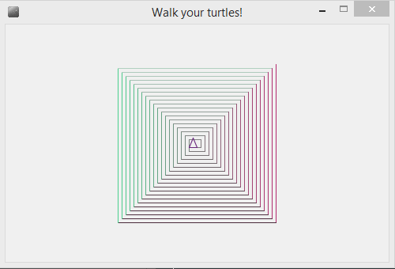

If you look at it closer, you will notice that the turtle started at the right upper corner facing down, moved forward some length, turned right 90 degrees, moved forward, turned, moved forward a slightly less distance (by 5 pixels, to be exact), turned, moved forward the same length as the last time, etc. 

So the pattern seems to be: move some length, turn right 90, move the same length, turn 90, and then repeat the same thing, but with the length 5 pixels less, and keep going until the length becomes too small (say, smaller than 5 pixels). 

Let's write this as a function. We know most of its parts: we have a helpful helper function `draw-line-and-turn`, we know that the Clojure `when` function would do perform an action only when a condition is true, and would do nothing otherwise (that would be helpful for stopping the repetition when the length is too small). 

Now we just need to know how to make a function repeat itself. And this turns out to be very simple: we just call the function using its name, like we always do! 

Here is the complete code (that you would write in `yourcode.clj`):
```clojure
(defn spiral
  "Makes a turtle with a given name draw a spiral of the strating side 
   length as given"
  [name length]
  (when (> length 5)
    (draw-line-and-turn name length)
    (draw-line-and-turn name length)
    (spiral name (- length 5))))
```
The function will draw two lines (with turns), then make another call to `spiral` with the same turtle name, but the length smaller by 5. That function call will draw the next two lines, then call spiral again, but with the smaller length, and so on. Once the length becomes 5 or less, `when` will do nothing instead of drawing the lines and making a call, so the function will stop.  

Now if you type `(spiral :trinity 200)`, you will see the same colorful spiral on your canvas! Since `:trinity` was at the center facing up, your spiral will be located differently. You can walk `:trinity` to the starting position (100, 100) first and make it face down, then clean its lines, and then call `spiral`, that will show the same spiral as in the picture. 


#### 10. [More challenging, optional] Clojure function filter (higher order function)

`filter` is another helpful Clojure function that allows you to work with vectors. Suppose you have a bunch of turtles, and you want all of the turtles that are pointing up (the angle is less than 180) to take a 20 pixel step forward. Filter can select all turtles facing up. After they are selected, you can use `map` to make them all move forward. 

Just like a `map`, `filter` can work with a template function. Here is how you perform this task: 
```clojure
(filter #(< (:angle (turtle-state %)) 180) (turtle-names))
```
Let's say there are three turtles on the canvas, and their state is 
```clojure
[{:trinity {:x 0, :y 0, :angle 90, :color [106 40 126]}} 
{:neo {:x -8.742278000372482E-7, :y 19.99999999999998, :angle 240, :color [3 61 196]}} 
{:oracle {:x 0, :y 0, :angle 120, :color [134 30 64]}}]
```
`filter` will pick the first turtle name, which is `:trinity`, and apply the template, so it will calling the function:
```clojure
(< (:angle (turtle-state :trinity)) 180)
```
`:trinity`'s angle is 90, which is smaller than 180, so the condition is true. Thus `:trinity` will be added to the resulting vector. 

Next it will check the same template condition for `:neo`:
template, so it will calling the function:
```clojure
(< (:angle (turtle-state :neo)) 180)
```
`:neo`'s angle is 240, which is not smaller than 180, so he doesn't get added to the result - sorry, `:neo`. 

`:oracle`'s angle is less than 180, so she is added to the result. 

As we just figured out, the result is:
```clojure
clojurebridge-turtle.walk=> (filter #(< (:angle (turtle-state %)) 180) (turtle-names))
(:trinity :oracle)
```

If we want to make only such turtles move forward, we can combine `filter` with `map`: 
```clojure
clojurebridge-turtle.walk=> (map #(forward % 20) (filter #(< (:angle (turtle-state %)) 180) (turtle-names)))
({:trinity {:length 20}} {:oracle {:length 20}})
```

This works (we see the right results), but it is very long. Alternatively we can use Clojure's ability to save results into variables, and then use them later. To define a variable, you use `def` (not `defn` as for a function), and you can define them in the REPL or in the file. We will go with the REPL option:

```clojure
clojurebridge-turtle.walk=> (def up-facing-turtles (filter #(< (:angle (turtle-state %)) 180) (turtle-names)))
#'clojurebridge-turtle.walk/up-facing-turtles
clojurebridge-turtle.walk=> (map #(forward % 20) up-facing-turtles)
({:trinity {:length 20}} {:oracle {:length 20}})
```

#### 11. [More challenging, optional] Exercise on filter
Use `filter` to make only turtles in the in the right upper quadrant move. 

#### Side note: Clojure randomness. 

Clojure has a convenient random number generator. You can use it to make a turtle walk a random distance or turn a random angle. 

##### Picking a random integer. 
Let's say we want our turtle to walk a random distance of at least 20 pixels, and up to 100. The distance will then be 20 plus a random chunk anywhere between 0 and 80. `(rand-int 80)` gives you that random part (which will be different every time you run your program). Thus your command may look like this:
```clojure
(forward :trinity (+ 20 (rand-int 80)))
```
Try it and see `:trinity` move different amounts every time. 

See more information on [rand-int](https://clojuredocs.org/clojure.core/rand-nth)

##### Choosing a random turtle out of a vector
Another useful function is `rand-nth` that selects a random element out of a vector. For instance, `(rand-nth (turtle-names))` will return the name of one of the turtles on the canvas, chosen at random. 

See more information on [rand-nth](https://clojuredocs.org/clojure.core/rand-nth)

#### 12: Exercises

At this point you can do anything you want with turtles. How about having several turtles on the canvas draw squares at random places? Or in a pattern? Making quilts? You can even draw pretty good circles by making turtles move forward very small distance and turn.

Talk to mentors about your ideas, we will be happy to suggest ways of implementing them. 

License
-------
<a rel="license"
href="http://creativecommons.org/licenses/by/4.0/deed.en_US"></a><br
/><span xmlns:dct="http://purl.org/dc/terms/"
href="http://purl.org/dc/dcmitype/Text" property="dct:title"
rel="dct:type">ClojureBridge Curriculum</span> by <span
xmlns:cc="http://creativecommons.org/ns#"
property="cc:attributionName">ClojureBridge</span> is licensed under a
<a rel="license"
href="http://creativecommons.org/licenses/by/4.0/deed.en_US">Creative
Commons Attribution 4.0 International License</a>.
