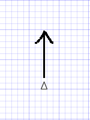
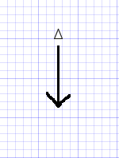
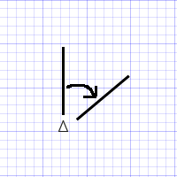
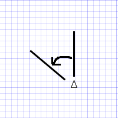
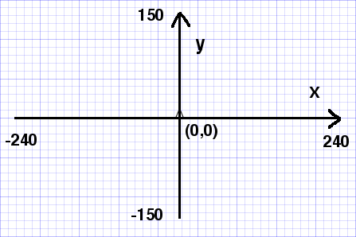
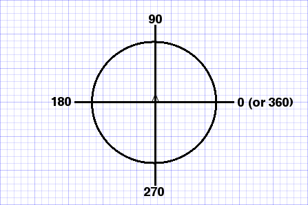

# Turtles App API

## Basics

- At the beginning, only one turtle whose name is :trinity (don't omit ':'
(colon), it is a Clojure keyword) will show up at the home position (center).
This turtle, :trinity, can move forward/backward,
change head angle clockwise/counterclockwise.


- Turtles can be added with a name.

- Each turtle can move independently giving a command with the name.
If only :trinity is there, you don't need to give the name to commands.


## Movement

All parameters to `forward`, `backward`, `right`, and `left` commands
are relative to the current position or angle.


| command | description |           |
| ------- | ----------- | ----------|
|`(forward len) (forward n len)`| moves the turtle forward by len.|  |
|`(backward len) (backward n len)`| moves the turtle backward by len.|  |
|`(right a) (right n a)`| changes the turtle head by degrees clockwise.| |
|`(left a) (left n a)`| changes the turtle head by degrees counterclockwise.| |
|`(undo) (undo n)`| undos the last line and back the turtle.||
|`(home) (home n)`| moves the turtle back to the home position.||
|`(home-all)`| moves all turtles back to the home position.||


### usage examples

```clojure
(forward 30)         ;; :trinity moves only when :trinity is there
(forward :neo 40)    ;; :neo moves

(backward 35)        ;; :trinity moves only when :trinity is there
(backward :neo 100)  ;; :neo moves

(right 45)           ;; :trinity tilts her head 45 degrees clockwise only when :trinity is there
(right :neo 90)      ;; :neo tilts his head 90 degrees clockwise

(left 30)            ;; :trinity tilts her head 30 degrees counterclockwise only when :trinity is there
(left :neo 135)      ;; :neo tilts his head 135 degrees counterclockwise

(undo)               ;; :trinity's last line will be removed only when :trinity is there
(undo :neo)          ;; :neo's last line will be removed

(home)               ;; moves :trinity back to the home position, center only when :trinity is there
(home :neo)          ;; moves :neo back to the home position, center

(home-all)           ;; moves all turtles back to the home position
```


## Turtle

| command | description |
| ------- | ----------- |
|`(add-turtle n)`| adds a turtle with its name.|
|`(turtle-names)`| returns all turtle names.|
|`(state) (state n)`| returns a current state of the turtle.|
|`(state-all)`| returns current states of all turtles.|


### usage examples

```clojure
(add-turtle :neo)    ;; adds a turtle whose name is :neo

(turtle-names)       ;; returns all turtle names

(state)              ;; returns :trinity's current state only when :trinity is there

(state :neo)         ;; returns :neo's current state

(state-all)          ;; returns all turtles' current states
```

The `state` command shows the *absolute* values not like relative values
used in `forward`, `backward`, `right` and `left`.
For example, `{:trinity {:x 0, :y 0, :angle 90, :color [30 30 30]}}`.

Absolute dimensions and angles are setup as in below:


##### x and y in absolute values

| position | x and y values |
| -------- | ---------------------------------------- |
|home      | both x and y are zero. `(x, y) = (0, 0)` |
|rightmost | x is 240, y is any. `(x, y) = (240, y)` |
|leftmost  | x is -240, y is any. `(x, y) = (-240, y)` |
|top       | x is any, y is 150. `(x, y) = (x, 150)` |
|bottom    | x is any, y is -150. `(x, y) = (x, -150)` |




##### angle in absolute degrees

| head     | angle |
| -------- | ----- |
| right    | 0 |
| up       | 90 |
| left     | 180 |
| down     | 270 |




## Clean up

| command | description |
| ------- | ----------- |
|`(clean) (clean n)`| cleans all lines belong to the turtle. |
|`(clean-all)`| cleans all lines of all turtles. |

### usage examples

```clojure
(clean)              ;; cleans all of :trinity's lines only when :trinity is there
(clean :neo)         ;; cleans all of :neo's lines

(clean-all)          ;; cleans all turtles all lines
```

## Initialize

| command | description |
| ------- | ----------- |
|`(init)`| makes back to the staring state. |

### usage examples

```clojure
(init)               ;; makes back to the starting state, only :trinity is in home position
```

## Samples

[How to Walk Turtles](TURTLE-SAMPLES.md) has more examples as well as
function study materials.

License
-------
<a rel="license"
href="http://creativecommons.org/licenses/by/4.0/deed.en_US"></a><br
/><span xmlns:dct="http://purl.org/dc/terms/"
href="http://purl.org/dc/dcmitype/Text" property="dct:title"
rel="dct:type">ClojureBridge Curriculum</span> by <span
xmlns:cc="http://creativecommons.org/ns#"
property="cc:attributionName">ClojureBridge</span> is licensed under a
<a rel="license"
href="http://creativecommons.org/licenses/by/4.0/deed.en_US">Creative
Commons Attribution 4.0 International License</a>.
